# Relatório da Aula Prática 1 de ALN

#### Aluno: Sillas Rocha da Costa

---
## Primeira Questão

Ao implementar o algoritmo base fornecido no [arquivo da aula prática](./AULA%20PRÁTICA%201.pdf), no arquivo [`Gaussian_Elimination_1.sci`](./Gaussian_Elimination_1.sci) foi possível observar os resultados esperados com testes simples, tanto as matrizes A e vetores b de entrada podem ser observados no arquivo da [questão 1 (quest_1.sci)](./quest_1.sci), a seguir estão as saídas observadas:

- 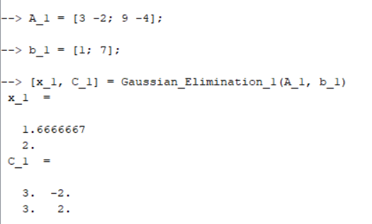
- 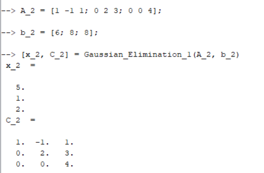
- 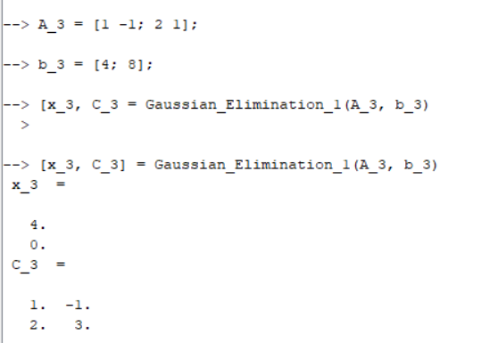
- 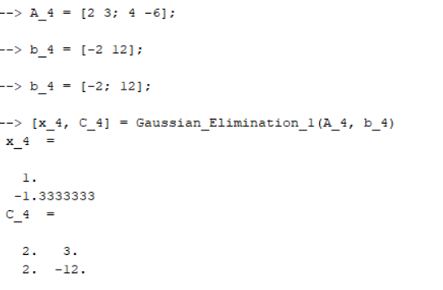

---
## Segunda Questão

Na segunda questão foi possível verificar que a implementação ainda não estava perfeita, pois apresentava problemas na decomposição com pivôs zero, possível verificar no arquivo da [questão 2 (quest_2.sci)](./quest_2.sci):

- 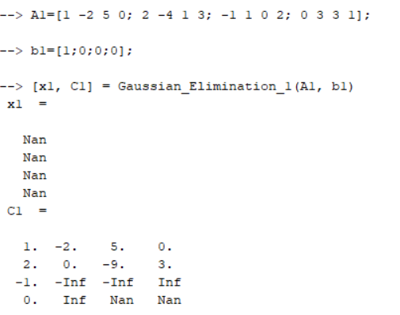

---
## Terceira Questão

A terceira, no arquivo [questão 3 (quest_3.sci)](./quest_3.sci), ao aprimorar o algoritmo no arquivo [`Gaussian_Elimination_2.sci`](./Gaussian_Elimination_2.sci) com a seguinte adição no algoritmo:

```
for j=1:(n-1)

    //O pivô está na posição (j,j)
    // Verifica se o pivô é 0

    if C(j,j) == 0 then
        // Se for então verifica outras linhas para substituir com um pivô diferente de 0

        vec = C(j+1:n, j);
        k = j + find(vec,1);

        C([j k],:) = C([k j],:);
        P([j k],:) = P([k j],:);
    end
```
Obtemos estes resultados:

- 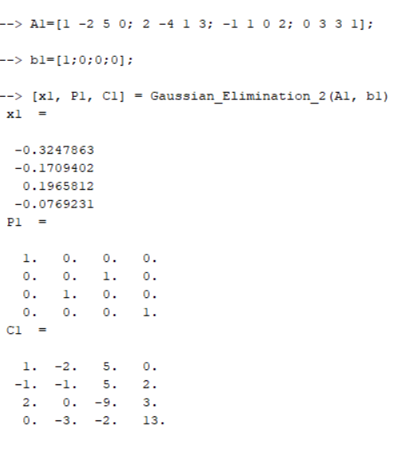
- 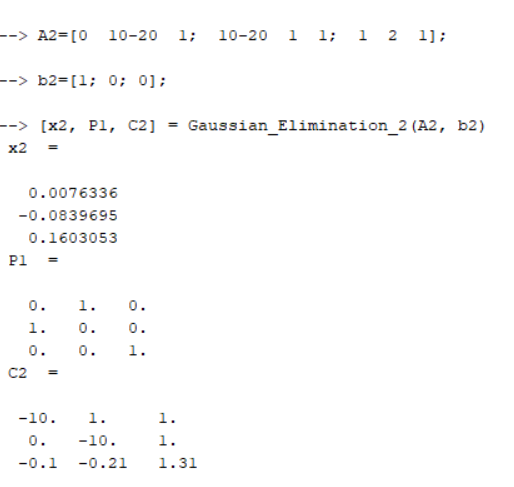

---
## Quarta Questão

Já na [questão 4 (quest_4.sci)](./quest_4.sci), ao aprimorar o  algoritmo para que ele substitua pelo pivô de maior valor, chemos na [`Gaussian_Elimination_3`](./Gaussian_Elimination_3.sci) com as seguintes alterações:

```
for j=1:(n-1) 
    //O pivô está na posição (j,j)
    // Verifica se o pivô é 0
    if C(j,j) == 0 then
        // Se for então verifica outras linhas para substituir com um pivô diferente de 0
       [num, index] = max(abs(C(j+1:n,j)));
       k = j + index
       
        C([j k],:) = C([k j],:);
        P([j k],:) = P([k j],:);
    end
```

E chegamos nos resultados:

- 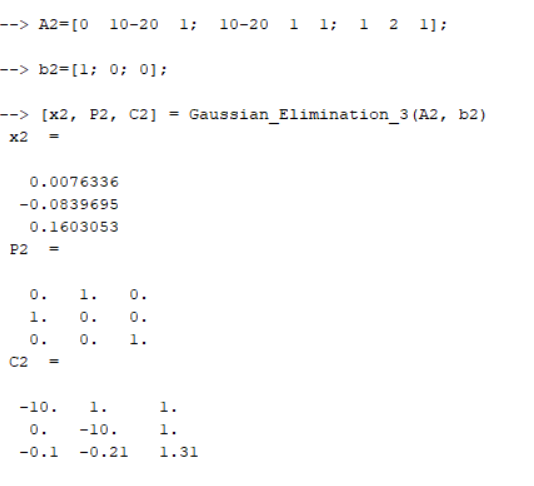
- 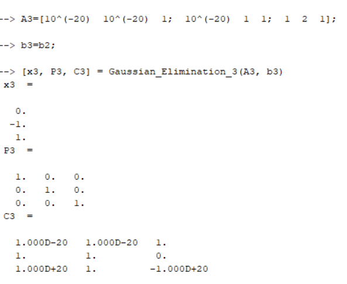

---
## Quinta Questão

Na [questão 5 (quest_5.sci)](./quest_5.sci) chegamos na implementação final da Eliminação Gaussiana, a [`Gaussian_Elimination_4`](./Gaussian_Elimination_4.sci), onde a substituição pelo maior pivô é o primeiro passo mesmo que o pivô seja não nulo:

```
for j=1:(n-1) 
    //O pivô está na posição (j,j)
    // Verifica se o pivô é 0
    
     [num, index] = max(abs(C(j:n,j)));
     k = j + index - 1;
       
     C([j k],:) = C([k j],:);
     P([j k],:) = P([k j],:);
```

Para obter os resultados seguintes:

- 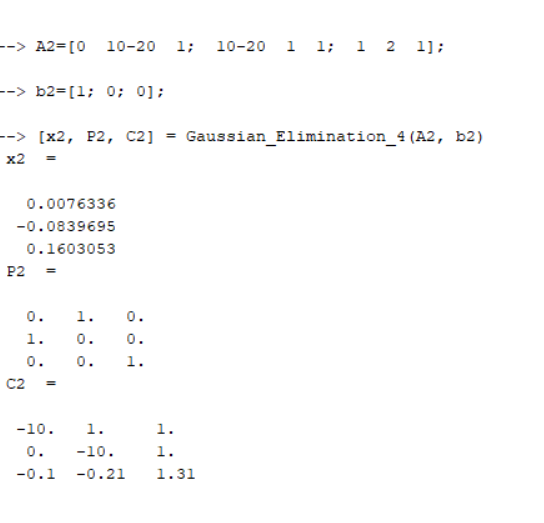
- 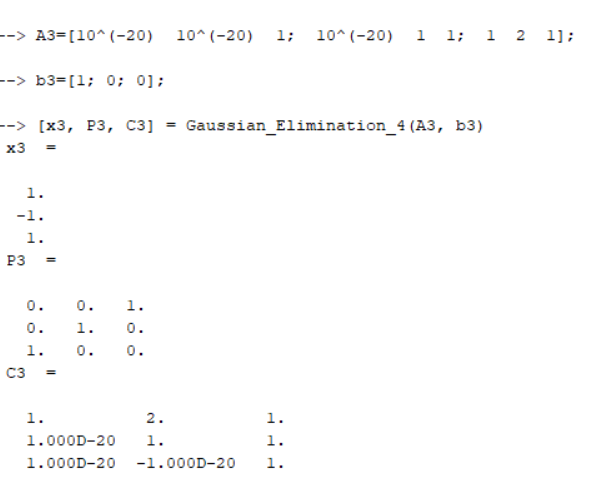

---
## Sexta Questão

Por fim, na [questão 6 (quest_6.sci)](./quest_6.sci), foi necessário implementar a função [Resolve_com_LU](./Resolve_com_LU.sci) sem uma função de base, entretando, a implementação acaba sendo bem simples e se resumindo a apenas:

```
Y(1,:)=B(1,:);
for i=2:n
    Y(i,:)=B(i,:)-C(i,1:i-1)*Y(1:i-1,:);
end

X(n,:)=Y(n,:)/C(n,n);
for i=n-1:-1:1
    X(i,:)=(Y(i,:)-C(i,i+1:n)*X(i+1:n,:))/C(i,i);  
end
```

Assim, com a implementação preparada, podemos verificar ela em ação:

- 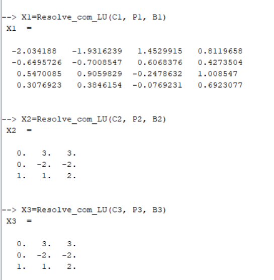
